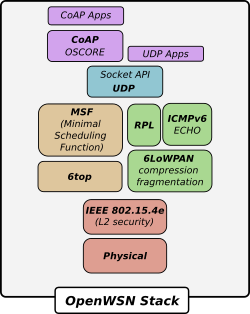
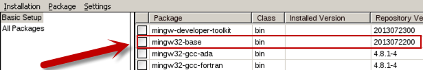
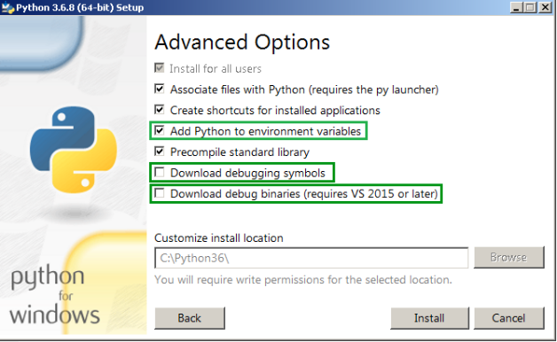
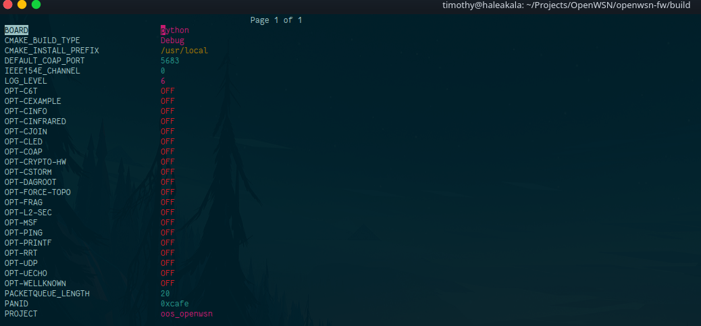

[](https://github.com/openwsn-berkeley/openwsn-fw/actions/workflows/linux.yml)
[](https://github.com/openwsn-berkeley/openwsn-fw/actions/workflows/windows.yml)
[](https://github.com/openwsn-berkeley/openwsn-fw/actions/workflows/macos.yml)

## Table of Contents
* [Overview](#overview)
* [Prerequisites](#prerequisites)
    - [Linux](#linux)
    - [Windows](#windows)
    - [Mac OSX](#mac)
* [Building](#building)
    - [Python board](#python-board)
    - [Cross-compiling](#cross-compiling)
    - [Optional modules](#optional-modules)
    - [Graphical configuration](#graphical)
* [Contributing](#contributing)
* [Contact](#contact)

## Overview <a name="overview"></a>

The OpenWSN project aims at building a reference implementation of the 6TiSCH networking stack. The project is split in 
two parts: [OpenWSN-FW](https://github.com/openwsn-berkeley/openwsn-fw) and [OpenVisualizer](https://github.com/openwsn-berkeley/openvisualizer).

* The OpenWSN-FW repository provides the C code that runs on constrained hardware.
* The [OpenVisualizer](https://github.com/openwsn-berkeley/openvisualizer) repository holds OpenVisualizer Python 
  packages that allows visualizing, debugging and interacting with an OpenWSN network.

The OpenWSN-FW code supports several hardware platforms:

* **openmote-cc2538:** a Cortex-M3 based SoC ([cc2538](https://www.ti.com/lit/ug/swru319c/swru319c.pdf?ts=1602851801717&ref_url=https%253A%252F%252Fwww.google.com%252F)) with an IEEE 802.15.4 compliant radio
* **openmote-b:** an updated version of the openmote-cc25538. 
* **iot-lab_M3:** a Cortex-M3 based CPU with the AR86RF231 radio.
* **python:** a Python C extension of the firmware code. Its goal is to emulate motes on a computer and simulate 
  a 6TiSCH network through [OpenVisualizer](https://github.com/TimothyClaeys/openvisualizer). The Python board allows
  easy development and debugging of the firmware code without the need of real hardware and (JTAG) debuggers.

|  |
| :----------------------------------------------------------: |
| *Overview of the different modules of the OpenWSN stack* |

## Prerequisites <a name="prerequisites"></a>

Depending on the hardware you are using and your operating system you will need different toolchains. 

### Linux (tested on Ubuntu 20.04 LTS) <a name="linux"></a>

#### OpenMote-CC2538, OpenMote-B, IoT-Lab_M3

To build for the firmware for the **openmote-cc2538**, **openmote-b** and  **iot-lab_M3** boards you will need to
install the [Arm GNU toolchain](https://developer.arm.com/tools-and-software/open-source-software/developer-tools/gnu-toolchain).

```shell
$ sudo add-apt-repository ppa:team-gcc-arm-embedded/ppa
$ sudo apt update
$ sudo apt install gcc-arm-none-eabi
```

#### Python board

To run the **python** board and build OpenWSN-FW as a Python C extension you will require GCC and Python3.6 or higher. 
Ubuntu 20.04 LTS comes with GCC and Python3.8 preinstalled, but you also need the `python-dev` containing the header 
files (e.g., `Python.h`) and libraries to build Python C extension.

```shell
$ sudo apt update
$ sudo apt install python-dev
```

### Windows 10 <a name="windows"></a>

#### OpenMote-CC2538, OpenMote-B, IoT-Lab_M3

To build for the firmware for the **openmote-cc2538**, **openmote-b** and  **iot-lab_M3** boards you will need to
install the [Arm GNU toolchain](https://developer.arm.com/tools-and-software/open-source-software/developer-tools/gnu-toolchain).

You can download the toolchain [here](https://developer.arm.com/tools-and-software/open-source-software/developer-tools/gnu-toolchain/gnu-rm/downloads).
Follow the installation wizard to complete the installation. Afterwards you verify the correct installation by opening
`cmd.exe` and typing:

```shell
$ arm-none-eabi-gcc --version
```

#### Python board

To build the Python C extension on Windows you will need the Microsoft compiler toolchain (>= 2015), 
MinGW (to get mingw32-make) and Python (>=3.6).

**_Microsoft Compiler Toolchain_**

The easiest way to get everything you need is to download [MSVC](https://visualstudio.microsoft.com/downloads/).

**_MinGW_**

You can find the installer [here](https://sourceforge.net/projects/mingw/). After installation, open the 
_MinGW Installation Manager_ and select `m̀ingw32-base`.

|  |
| :----------------------------------------------------------: |
| *Installing MinGW-base* |

**_Python_**

Python is not included in the default Windows installation so you need to install it manually. You can download
a recent Python version [here](https://www.python.org/downloads/). 

:information_source:**NOTE**:information_source:: During the installation you should make sure to select:

- _Add Python to environment variables_

So you can simply type `python` in your command prompt, and 

- _Download debugging symbols_
- _Download debug binaries_

otherwise you won't be able to build the Python extension in debug mode. 

|  |
| :----------------------------------------------------------: |
| *Python installation wizard on Windows* |

### Mac OSX <a name="mac"></a>


## Building <a name="building"></a>

To build the project we use `cmake`. The `cmake` workflow uses in two steps: 

1. Configuring and generating
2. Build

:information_source:**NOTE**:information_source:: By default `cmake` will select (during the configure step) your standard system compiler 
(CC/CXX environment variables in Linux) to compile the project code. If you wish to cross-compile for constrained 
hardware you need to  tell `cmake` explicitly to use a different toolchain by providing it with a _toolchain file_.

### Cross-compiling <a name="cross-compiling"></a>

When you build the firmware for a specific target you should specifiy the board name and the toolchain file. For example, 
to compile for the `openmote-cc2538`, move to the root of the repository and type the following:

```shell
$ mkdir build && cd build
$ cmake .. -DBOARD=openmote-cc2538 -DCMAKE_TOOLCHAIN_FILE=cmake/toolchains/cc2538.cmake
```

As output of the command you should see something like this:

```shell
-- The C compiler identification is GNU 9.3.1
-- The ASM compiler identification is GNU
-- Found assembler: /opt/arm_toolchains/gcc-arm-none-eabi-9-2020-q2-update/bin/arm-none-eabi-gcc
-- Detecting C compiler ABI info
-- Detecting C compiler ABI info - done
-- Check for working C compiler: /opt/arm_toolchains/gcc-arm-none-eabi-9-2020-q2-update/bin/arm-none-eabi-gcc - skipped
-- Detecting C compile features
-- Detecting C compile features - done

-- OPENWSN-FW:..................VERSION-2.0
-- COMPILER TOOLCHAIN:..........GNU
-- COMPILER VERSION:............9.3.1
-- CMAKE_GENERATOR:.............Unix Makefiles
-- BOARD:.......................openmote-cc2538
-- PROJECT:.....................oos_openwsn
-- BUILD_SHARED_LIBS............OFF
-- CMAKE_BUILD_TYPE:............Debug
-- SANITIZERS:..................OFF

-- PRINTF:......................OFF
-- LOG LEVEL:...................6
-- CRYPTO HARDWARE:.............OFF

-- CHANNEL HOPPING:.............0
-- ADAPTIVE-MSF:................OFF
-- FORCE TOPOLOGY:..............OFF
-- L2 SECURITY:.................OFF
-- 6LOWPAN-FRAG:................OFF
-- PING:........................OFF
-- UDP:.........................OFF
-- PACKETQUEUE_LENGTH:..........20
-- PANID:.......................0xcafe
-- DAGROOT:.....................OFF

-- COAP:........................OFF
-- DEFAULT COAP PORT:...........5683

-- CJOIN:.......................OFF
-- CSTORM:......................OFF
-- CEXAMPLE:....................OFF
-- CLED:........................OFF
-- CINFRARED:...................OFF
-- CINFO:.......................OFF
-- C6T:.........................OFF
-- UECHO:.......................OFF
-- RRT:.........................OFF
-- WELLKNOWN....................OFF

-- Configuring done
-- Generating done
-- Build files have been written to: /home/timothy/Projects/OpenWSN/openwsn-fw/build

```

Make sure to verify that the board name is set to `openmote-cc2538` and the compiler toolchain is `GNU`.
From the same `build` directory you can now start the compilation process. 

```shell
cmake --build .
```

When the compilation process ends it prints out a small summary of the size of the compiled binary.

```shell
[100%] Linking C executable oos_openwsn
   text	   data	    bss	    dec	    hex	filename
  75620	    652	  14972	  91244	  1646c	/home/timothy/Projects/OpenWSN/openwsn-fw/build/projects/common/03oos_openwsn/oos_openwsn
[100%] Built target oos_openwsn

```

For a new build (after you change something in the code), you don't need to do the configuration step again. You can simply
retype the build command `cmake --build .`. If you wish to build from scratch you should
remove the `build` folder entirely.

### Compiling the Python C extension  <a name="python-board"></a>

When building for the Python board we don't call cmake directly but through the `setup.py` script. The script is 
responsible for building the Python C extension and installs it in the local user _site-packages_ directory.

Move to the root of the repository and type:

```shell
$ python setup.py install --user
```

The `setup.py` file automatically configures CMake for you and compiles the entire project. 

To test if the build and installation was successful you can type:

```shell
$ python -c "import openwsn"
```
:warning:**WARNING**:warning:: Do not delete the Python build artifacts or you won't be able to import the `openwsn` Python module.

### Optional OpenWSN-FW options  <a name="optional-modules"></a>

In the above steps you have compiled the project in its basic minimalistic configuration, however, OpenWSN can use a 
bunch of optional modules. To use these optional modules you need to specify them during the CMake configuration.

**Cross-compilation:**

```shell
$ cmake .. -DBOARD=openmote-cc2538 -DOPT-PING=ON -DOPT-UDP -DCMAKE_TOOLCHAIN_FILE=cmake/toolchains/cc2538.cmake
```

To output of the configuration step should now have changed to:

```shell
-- PING:........................ON
-- UDP:.........................ON
```

**Python C extension**

To add options to the `setup.py` file you must specify them after the `--user` argument.

```shell
python setup.py install --user -DOPT-PRINTF=ON -DOPT-UDP=ON
```

### Graphical configuration <a name="graphical"></a>

CMake also provides to option to configure the project through a TUI and/or GUI.

For cross-compilation simply type ```ccmake ..``` (not on Windows) or ```cmake-gui``` from the `build` folder to open up 
the graphical configuration screen.

|  |
| :----------------------------------------------------------: |
| *ccmake configuration GUI* |


## Contributing <a name="contributing"></a>

## Contact <a name="contact"></a>

Mailing list: openwsn@lists.eecs.berkeley.edu

